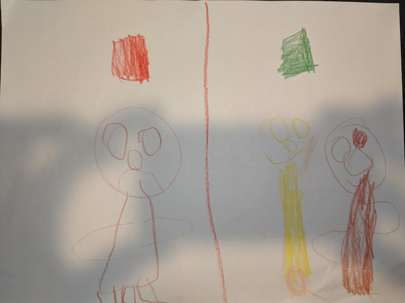
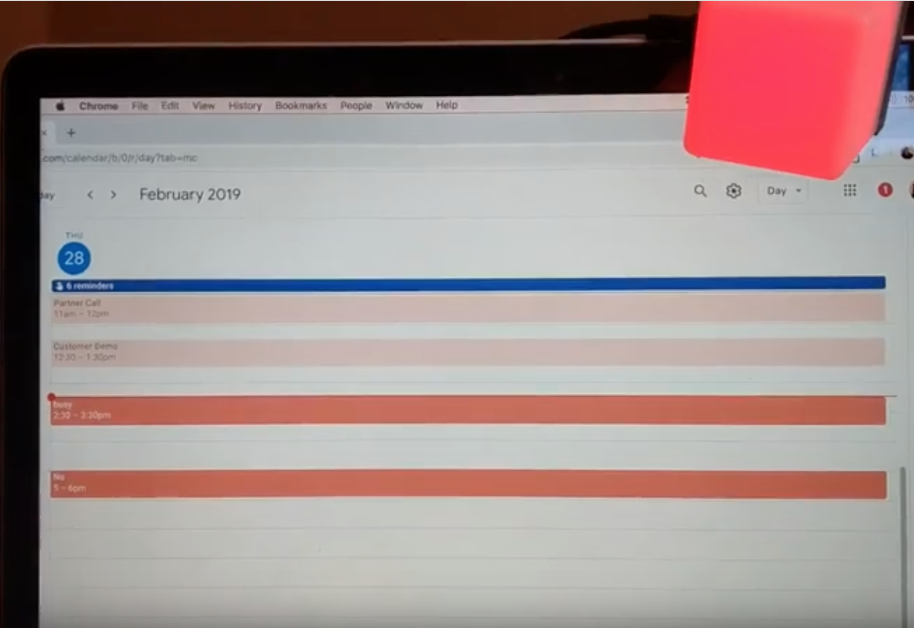
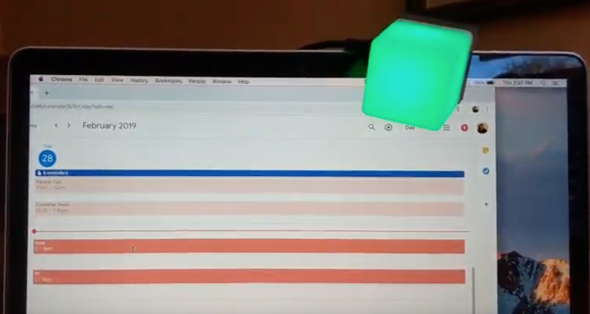

# Blync Studio Light

go based CLI to set Blync light based on calendar or manual interaction.


### here is a picture my daughter drew to explain. 
I hang my light outside my home office to convey to family if they can visit.


Red means don't go in, sad daughter.  Green means it's ok to visit daddy, happy daughter!

### Light updates based on free/busy events.




## Build / Install
You can leave in a working driectory as build, or install to central repo this doc aassumes install.
```
CGO_LDFLAGS_ALLOW='-fconstant-cfstrings' go install


~/go/bin/blync-studio-light -h 
```


## Configure schedule and interact with calendar
```
~/go/bin/blync-studio-light -h # help, options, etc


# get started
~/go/bin/blync-studio-light config init
~/go/bin/blync-studio-light config schedule #(optional to set working hours and days off which light will go dark)


```


## Get and provide google credentials.

you need a credentials.json file fomr goolge that allows access to calendar APIs.  (https://console.cloud.google.com/apis/credentials)

```
mkdir -p ~/.studio-light/gcal
mv ~/Downloads/client_secret[FILE YOU GO FROM GOOGLE].json ~/.studio-light/gcal/credentials.json


~/go/bin/blync-studio-light config login
# follow steps.git 
```

## Keeping the light accurate
```

# add this command to crontab
~/go/bin/blync-studio-light calendar refresh

```

### Example Cron file
```
# Run every minute, do not send mail.
* * * * * /Users/ewebbinaro/go/bin/blync-studio-light > /dev/null 2>&1
```


## Building /Testing

Due to the HID dependencies used by this prohect, you need to allow unsupported flags.

`CGO_LDFLAGS_ALLOW='-fconstant-cfstrings' go build`

